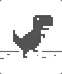

# Hello world! 

- 😄 **Pronouns:** she/her
<!--
- 🌱 **Currently learning:** full-stack web development
- 🔭 **Currently working on:** school projects!
- 🚀 **Skills:** Java, TypeScript, Python, SQL, HTML/CSS, React, C, C++
- 🔨 **Tools:** Git, Figma, VSCode, Unix
- ✨ **Interests:** CTF (beginner), video games, art, writing, First Aid
-->
<!--
**maggiey22/maggiey22** is a ✨ _special_ ✨ repository because its `README.md` (this file) appears on your GitHub profile.

Here are some ideas to get you started:

- 🔭 I’m currently working on ...
- 🌱 I’m currently learning ...
- 👯 I’m looking to collaborate on ...
- 🤔 I’m looking for help with ...
- 💬 Ask me about ...
- 📫 How to reach me: ...
- 😄 Pronouns: ...
- ⚡ Fun fact: ...
-->
